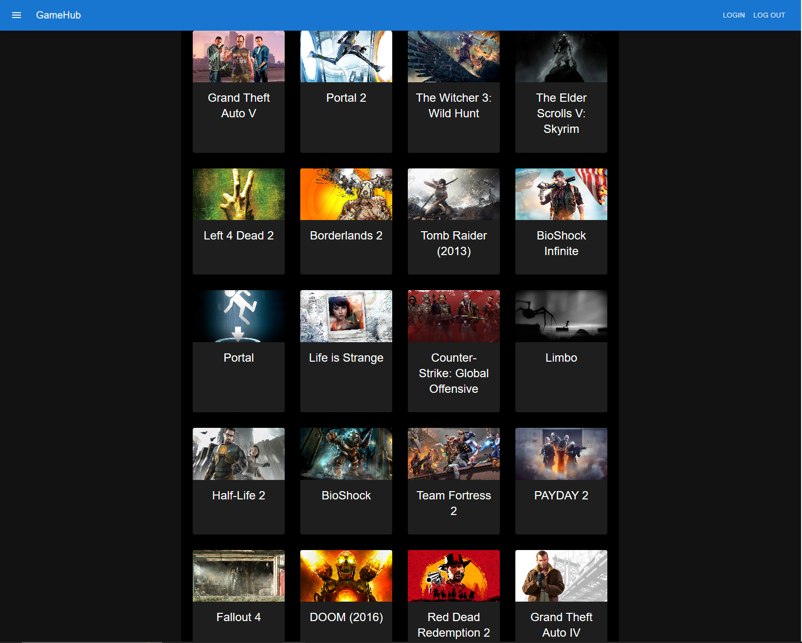

# GameHub

[](https://opensource.org/licenses/MIT)

## Description
A video game catalog/database application to find out more information about new and old video games, connect with friends and save games to your profile.

## Screenshot


## Table of Contents 

  - [User Story](#use-story)
  - [Acceptance Criteria](#acceptance-criteria)
  - [API used](#api-used)
  - [Languages Used](#languages-used)
  - [Deployed Link](#deployed-link)
  - [Installation](#installation)
  - [Credits](#credits-@-2023)
  - [License](#license)

## User Story
```
AS a USER
I WANT to be able to view video games by genre and platform
SO THAT I am presented with cards of video games
I WANT to be able to click on a video game card
SO THAT I can find more information about the video game and see screenshots
I WANT to be able to login and have a profile
SO THAT I can save video games to my profile
```

## Acceptance Criteria
```
GIVEN a webpage with a drop-down/input bar
WHEN I search for a video game genre
THEN I am presented with video games that match that genre
WHEN I click on a video game card
THEN I get more information about that video game
```

## API used
* RAWG

## Languages Used
* Front-end Languages : Material.UI
* Back-end Languages : React, Javascript
* Database Languages : Mongo/Mongoose, graphQL

## Deployed Link
https://gamehub1.herokuapp.com/
  
## Credits @ 2023
* Erich Ziegler
* Cody Lawson
  
## License
This project is under the [](https://opensource.org/licenses/MIT)
